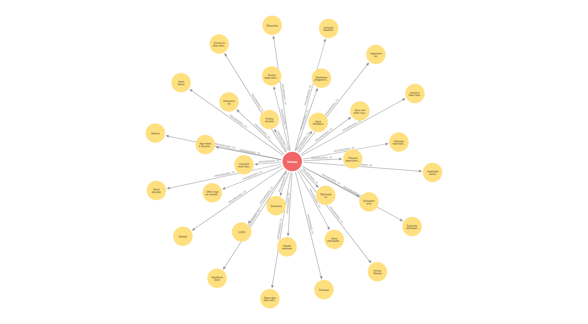
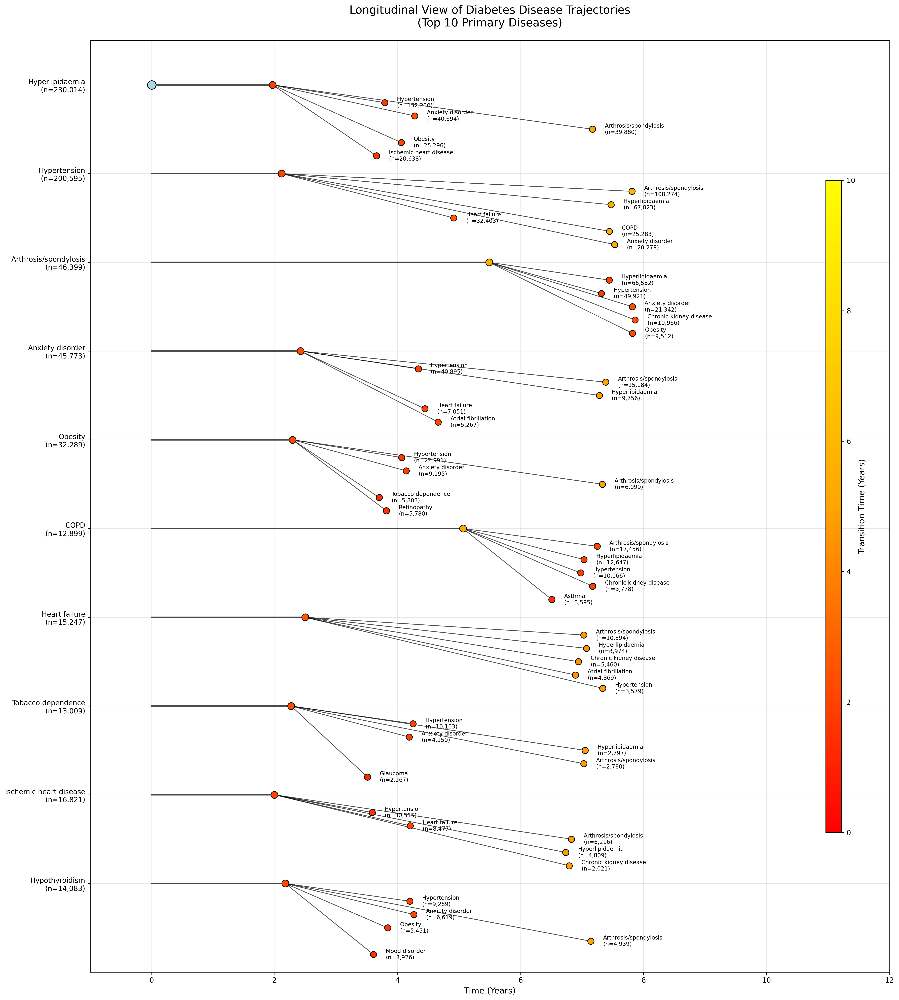
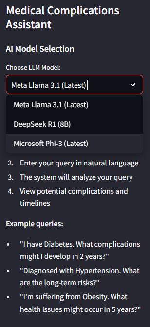
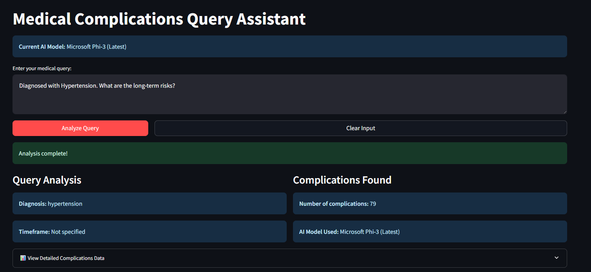
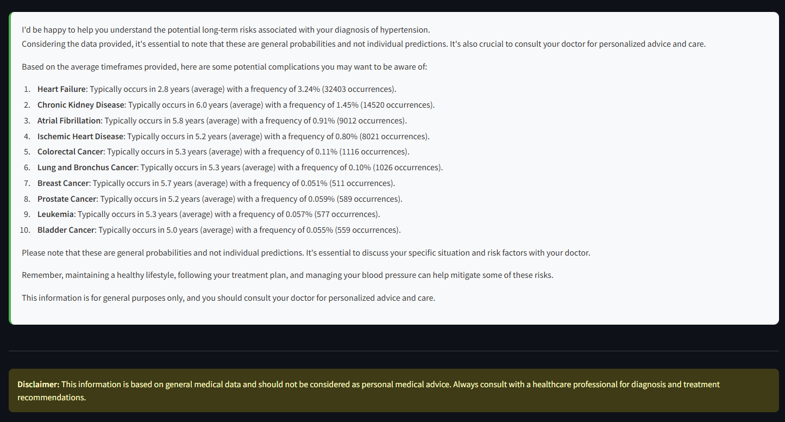

# Temporal Knowledge Graph - Neo4j-Based Implementation for Disease Progression Analysis with applications in healthcare AI using GraphRAG 
Full article in [Medium](https://medium.com/@shasankashekharpadhi/mapping-diabetes-trajectories-with-temporal-knowledge-graphs-graphrag-fd805dad0572)

## Overview  
[CAMDA](https://bipress.boku.ac.at/camda2025/the-camda-contest-challenges/#synthetic-health-records): The Synthetic Clinical Health Records Challenge provides a rich set of highly realistic Electronic Health Records (EHRs) tracing the diagnosis trajectories of diabetic patients, created with dual-adversarial auto-encoders trained on data from 1.2 million real patients in the Population Health Database of the Andalusian Ministry of Health. Predict relevant diabetes endpoints like blindness or cardiopathy from past diagnosis trajectories!

DATASET DESCRIPTION:  DualAAE-EHR DIABETES GEN3 for CAMDA (diabetes-dualAAE-EHR-CAMDA GEN3):
A 3rd generation synthetic dataset was generated by the same DualAA -EHR model from an extended population of 1062550 real diabetes patents.  
The 999,936 patients for this third generation synthetic EHRs were generated extended visit dates and new patients till end of 2022. Each patient is still coded as a ordered list of visits, each of them with a list of co-occurring chronic diagnoses. As the diagnoses are chronic they all affect patients from the time recorded onwards.
This pre-processed version reduces the number of patients to 994,095 by performing the following cleaning steps:  
1. Patients without diabetes code were discarded.
2. Empty visits or visits only with age codes were removed.
3. Only the first appearance of each diagnosis was kept (as they are chronic diseases).
4. In case several age codes are provided in one visit, the code of the older age is kept.
5. In visits without age code, age is inferred. Average age between previous and posterior visit is considered. In case visit is the first or last one, same age as posterior or previous visit is considered, respectively.

Finding some strong relationships in diabetes-associated pathologies that allows to predict any pathology before this is diagnosed.  
Another proposed challenge is the prediction of disease trajectories in diabetes patients (see for example: Jensen et al. Nat Commun. 2014)

So, with this information about the dataset from CAMDA each visit was converted to an edge connecting the disease that is diagnosised capture the trajectory.

---
## Prerequisites  
- Neo4j  
- Python   
- Neo4j Python Driver (`pip install neo4j`)  
- Ollama

## KG Schema
Node: Diagnosis:{Node attributes-> name, code}  
Edge: PROGRESSES_TO:{Edge attributes: Time intervals and its statistics(stratified into overall,male and female)}  

Schema: Diagnosis-[PROGRESSES_TO]->Diagnosis

## Trajectories

## GraphRAG - Streamlit application
Due to the limited data available the only type of query that can be retrived from the KG was:
1. I am diagnosed with disease X (prominantly Diabetes and its related disease due to limitation of the data). What are the complications I should be careful about?
2. I am diagnosed with X disease. What are the complications I might be susceptible to in 2 years time?  

The UI gives users an option to select the LLM model to use between Llama, Deepseek R1 and Phi3 for generation. The query is mapped to a defined Cypher query which retrives the relevant details from Neo4j.

 
 
So upon giving an simple query for retriving details related to hyper tension and enquiring about any long term risk, the model summarize the following based on the retrived data

